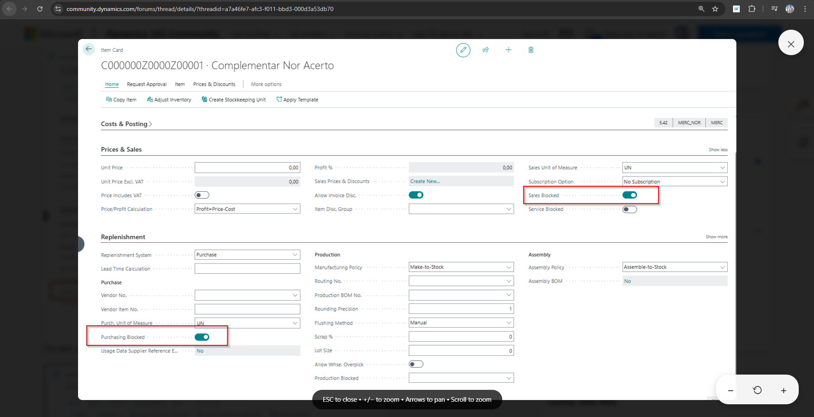
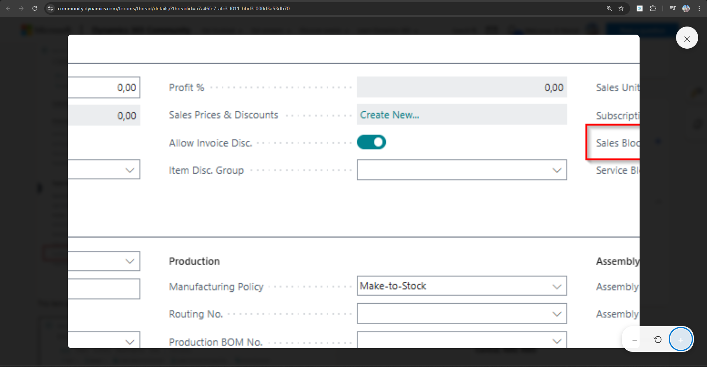

# Dynamics Community Image Viewer

A lightweight browser extension that enables inline image preview on Microsoft Dynamics Community forums without downloading files.

[](LICENSE)
[](https://developer.chrome.com/docs/extensions/mv3/intro/)

> 🌐 **[🖼️ Dynamics Community Image Viewer](https://taher-el-mehdi.github.io/dynamics-community-image-preview/)** for a visual overview and installation guide

## 🎯 Why This Extension?

### The Problem

On Dynamics Community forums, shared images aren't previewable inline. You must **download each image locally** just to view it—which is slow, disruptive, and breaks your reading flow.

### The Solution

This extension enables **one-click inline preview** with a beautiful modal, zoom controls, and keyboard shortcuts—no downloads required!

| Without Extension | With Extension |
|------------------|----------------|
| ❌ Must download images | ✅ Instant inline preview |
| ❌ Cluttered downloads folder | ✅ Clean browsing experience |
| ❌ Slow workflow | ✅ Fast, seamless workflow |
| ❌ No zoom/pan controls | ✅ Advanced zoom & pan |
| ❌ Context switching | ✅ Stay in the forum |

## 📸 Visual Preview

### Extension in Action

<div align="center">
  
  <p><em>Image links on Dynamics Community forums with preview indicators</em></p>
</div>

### Image Preview Modal

<div align="center">
  
  <p><em>Beautiful lightbox modal with zoom and pan controls</em></p>
</div>

### Zoom & Pan Features

<div align="center">
  
  <p><em>Mouse wheel zoom, keyboard shortcuts, and drag-to-pan support</em></p>
</div>

---

## 🎯 Features

| Feature | Description | Preview |
|---------|-------------|----------|
| **🔍 Inline Preview** | View images directly in the browser without downloading |  |
| **🖱️ Click-to-Preview** | Click any image link or attachment to open a lightbox modal |  |
| **🔎 Zoom & Pan** | Mouse wheel zoom, keyboard shortcuts, and drag support |  |
| **⌨️ Keyboard Navigation** | Full keyboard control (ESC, +/−, Arrow keys) | ✅ ESC, +/−, 0, Arrows |
| **⚡ Lightweight** | Pure vanilla JavaScript, no external dependencies | ~30KB total |
| **🔒 Privacy-First** | No tracking, no external network calls, no data collection | Zero telemetry |
| **📱 Responsive** | Works seamlessly on desktop and mobile browsers | All devices |
| **♿ Accessible** | High contrast mode, reduced motion support, keyboard accessible | WCAG compliant |

## 🚀 Installation

### Chrome / Edge

#### Option 1: Install from Source (Developer Mode)

1. **Download or Clone** this repository:
   ```bash
   git clone https://github.com/taher-el-mehdi/dynamics-community-image-preview.git
   ```

2. **Open Extension Management Page**:
   - Chrome: Navigate to `chrome://extensions/`
   - Edge: Navigate to `edge://extensions/`

3. **Enable Developer Mode**:
   - Toggle the "Developer mode" switch in the top right corner

4. **Load the Extension**:
   - Click "Load unpacked"
   - Select the `community-image-viewer` folder
   - The extension icon should appear in your toolbar

5. **Verify Installation**:
   - Visit https://community.dynamics.com/forums/
   - Image links should now have a 🔍 icon
   - Click any image to preview it

#### Option 2: Install from Chrome Web Store (Coming Soon)

_Extension will be submitted to the Chrome Web Store for easier installation._

### Firefox

_Firefox support coming soon. The extension uses Manifest V3 which is fully compatible with Firefox._

## 📖 Usage

### Basic Usage

1. **Navigate** to any thread on https://community.dynamics.com/forums/
2. **Click** on any image link or attached image
3. **Preview** opens in a beautiful lightbox modal
4. **Close** by clicking outside the image, pressing ESC, or clicking the × button

<div align="center">
  
  <p><em>Step-by-step: Find images → Click to preview → Enjoy full-size view</em></p>
</div>
4. **Close** by clicking outside the image, pressing ESC, or clicking the × button

### Keyboard Shortcuts

| Key | Action |
|-----|--------|
| `ESC` | Close modal |
| `+` or `=` | Zoom in |
| `-` or `_` | Zoom out |
| `0` | Reset zoom |
| `Arrow Keys` | Pan image when zoomed |
| `Mouse Wheel` | Zoom in/out |

### Mouse Controls

- **Click** on image links or attachments to preview
- **Click outside** modal to close
- **Click & Drag** zoomed images to pan
- **Mouse Wheel** over image to zoom in/out

## � Screenshots Gallery

### 1. Extension Integration
The extension seamlessly integrates with Dynamics Community forum threads, adding visual indicators to all image links.


### 2. Image Preview Modal
Click any image to open a beautiful, responsive lightbox modal with smooth animations.


### 3. Zoom & Pan Controls
Advanced zoom features with mouse wheel support, keyboard shortcuts, and intuitive drag-to-pan.


---

## �🛠️ Technical Details

### Architecture

```
community-image-viewer/
├── src/
│   ├── content.js         # Core logic for image detection & modal
│   └── styles.css         # Modal styling and animations
├── assets/
│   ├── icon16.png         # Extension icon (16x16)
│   ├── icon48.png         # Extension icon (48x48)
│   ├── icon128.png        # Extension icon (128x128)
│   └── ICONS_README.txt   # Icon creation guide
├── docs/
│   ├── INSTALL.md         # Installation guide
│   ├── QUICK_REFERENCE.md # User quick reference
│   ├── CONTRIBUTING.md    # Contribution guidelines
│   ├── PROJECT_SUMMARY.md # Project overview
│   └── DEPLOYMENT_CHECKLIST.md # Pre-launch checklist
├── tests/
│   └── test-helper.js     # Testing utilities
├── manifest.json          # Extension configuration (Manifest V3)
├── README.md              # Main documentation
├── LICENSE                # MIT License
└── .gitignore            # Git ignore rules
```

### Key Features

- **Manifest V3 Compliant**: Uses latest extension standards
- **Content Script Only**: No background scripts, minimal permissions
- **MutationObserver**: Detects dynamically loaded images
- **CSS Animations**: Smooth transitions and visual feedback
- **Accessibility**: ARIA labels, keyboard navigation, high contrast support
- **No External Dependencies**: Pure vanilla JavaScript & CSS

### Permissions

- `storage`: Save user preferences (zoom settings, preview mode)
- `host_permissions`: Access to `https://community.dynamics.com/*` only

### Browser Compatibility

| Browser | Version | Status |
|---------|---------|--------|
| Chrome | 88+ | ✅ Supported |
| Edge | 88+ | ✅ Supported |
| Firefox | 109+ | 🔄 Coming Soon |
| Opera | 74+ | ✅ Supported |
| Brave | 1.35+ | ✅ Supported |

## 🔧 Configuration

The extension works out of the box with sensible defaults. Advanced configuration coming soon via options page:

- Toggle hover preview mode
- Adjust hover delay
- Enable/disable zoom controls
- Customize keyboard shortcuts

## � Documentation

For more detailed information, see:
- **[Installation Guide](docs/INSTALL.md)** - Step-by-step setup instructions
- **[Quick Reference](docs/QUICK_REFERENCE.md)** - Keyboard shortcuts and tips
- **[Contributing](docs/CONTRIBUTING.md)** - How to contribute to the project
- **[Project Summary](docs/PROJECT_SUMMARY.md)** - Complete project overview
- **[Deployment Checklist](docs/DEPLOYMENT_CHECKLIST.md)** - Pre-launch checklist

## �🐛 Troubleshooting

### Images don't show preview icon

- **Check permissions**: Ensure the extension has access to `community.dynamics.com`
- **Refresh the page**: Press Ctrl+Shift+R (hard refresh)
- **Check Console**: Open DevTools (F12) and look for errors

### Modal doesn't open

- **JavaScript errors**: Check browser console for errors
- **Conflicting extensions**: Disable other extensions temporarily
- **Update browser**: Ensure you're running a modern browser version

### Images fail to load

- **Network issues**: Check your internet connection
- **CORS restrictions**: Some images may have cross-origin restrictions
- **Forum changes**: Microsoft may have updated the forum structure

## 🤝 Contributing

Contributions are welcome! Please follow these steps:

1. **Fork** the repository
2. **Create** a feature branch: `git checkout -b feature/amazing-feature`
3. **Commit** your changes: `git commit -m 'Add amazing feature'`
4. **Push** to the branch: `git push origin feature/amazing-feature`
5. **Open** a Pull Request

### Development Setup

```bash
# Clone the repository
git clone https://github.com/taher-el-mehdi/dynamics-community-image-preview.git
cd community-image-viewer

# Make changes to files in src/ folder
# - src/content.js (main logic)
# - src/styles.css (styling)

# Test in browser
# 1. Go to chrome://extensions/
# 2. Click "Reload" on the extension card
# 3. Refresh the Dynamics Community forum page
```

### Code Style

- Use ES6+ features
- Add comments for complex logic
- Follow existing code structure
- Keep functions small and focused
- Test thoroughly before submitting

## 📝 Changelog

### Version 1.0.0 (2026-01-03)

- ✨ Initial release
- ✅ Click-to-preview functionality
- ✅ Zoom and pan support
- ✅ Keyboard navigation
- ✅ Responsive design
- ✅ Accessibility features
- ✅ Manifest V3 compliant

## 📄 License

This project is licensed under the MIT License - see the [LICENSE](LICENSE) file for details.

## 🙏 Acknowledgments

- Inspired by the need for better UX on Dynamics Community forums
- Built with ❤️ for the Microsoft Dynamics community
- Special thanks to all contributors

## 🔗 Links

- **GitHub Repository**: https://github.com/yourusername/community-image-viewer
- **Report Issues**: https://github.com/yourusername/community-image-viewer/issues
- **Dynamics Community**: https://community.dynamics.com/forums/

## ⚠️ Disclaimer

This is an independent open-source project and is not affiliated with, endorsed by, or sponsored by Microsoft Corporation.

---

**Made with 💙 for the Dynamics Community**

---

## 🚀 Features

* 🖼️ Inline image preview for forum posts
* 🔍 Click-to-preview (modal / lightbox)
* 👁️ Hover-to-preview (optional)
* ⚡ No need to download images locally
* 🧠 Automatically detects image links & attachments
* 🪶 Lightweight & privacy-friendly (no tracking)

---

## 🧩 Supported Pages

* [https://community.dynamics.com/forums/](https://community.dynamics.com/forums/)*

---

## 🛠️ Tech Stack

* Manifest V3
* Vanilla JavaScript
* CSS (Lightbox / Modal)
* Chrome & Edge compatible

---

## 📦 Installation (Developer Mode)

1. Clone the repository
2. Open Chrome / Edge
3. Go to `chrome://extensions`
4. Enable **Developer mode**
5. Click **Load unpacked**
6. Select the project folder

---

## 🔒 Permissions

The extension only accesses:

* `community.dynamics.com` pages

No data is collected or sent externally.

---

## 🧪 Future Enhancements

* Zoom & pan images
* Keyboard navigation (← → Esc)
* Toggle preview behavior (hover vs click)
* Firefox support

---

## 🤝 Contributing

PRs and ideas are welcome! This tool is built **by Dynamics consultants, for Dynamics consultants**.

---

## 📄 License

MIT License

---

## 🙌 Motivation

Built out of daily frustration while reading helpful answers on the Dynamics Community forums — great content deserves better UX.
